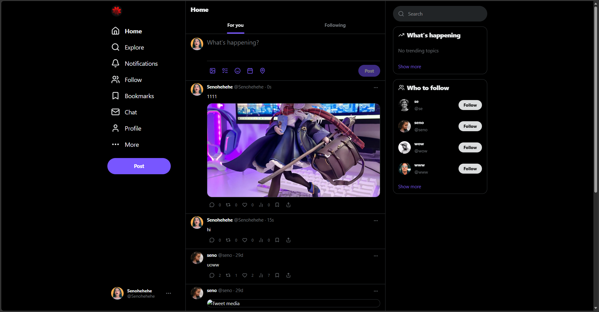
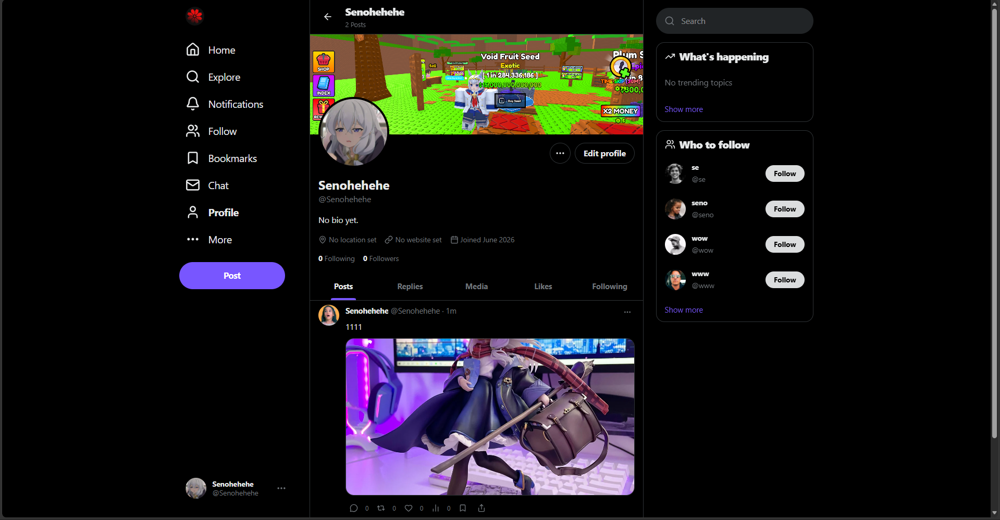

<!-- ════════════════════════════════════════════════════════════════ -->
<!--                          EVOLIX  ·  README                        -->
<!-- ════════════════════════════════════════════════════════════════ -->

<div align="center">


<h1>Evolix</h1>

<p><strong>Nền tảng microblogging thời gian thực — lấy cảm hứng từ Twitter / X</strong></p>

<p><em>Đồ án môn <strong>NT208.Q24 — Phát triển ứng dụng Web</strong></em></p>

<!-- ─────────────────────────  Badges  ───────────────────────── -->
<p>
  
  
  
  
  
  
</p>

<p>
  <a href="#-tính-năng">Tính năng</a> ·
  <a href="#-kiến-trúc">Kiến trúc</a> ·
  <a href="#-cài-đặt">Cài đặt</a> ·
  <a href="#-hiệu-năng">Hiệu năng</a> ·
  <a href="#-load-testing">Load testing</a> ·
  <a href="#-api">API</a>
</p>

</div>

---

## 🖼️ Giao diện

<div align="center">

<table>
  <tr>
    <td align="center" width="50%">
      <br/>
      <sub><b>Trang chủ</b> — bảng tin <i>For you</i> / <i>Following</i>, đăng bài kèm ảnh & video</sub>
    </td>
    <td align="center" width="50%">
      <br/>
      <sub><b>Trang cá nhân</b> — ảnh bìa, avatar, danh sách bài viết & follower</sub>
    </td>
  </tr>
</table>

</div>

---

## ✨ Tính năng

<table>
<tr>
<td valign="top" width="50%">

**Tài khoản & bảo mật**
- ✅ Đăng ký / Đăng nhập / Đăng xuất
- ✅ Xác thực JWT (Bearer token) + bcrypt
- ✅ Đổi tên hiển thị / email / mật khẩu / username
- ✅ Upload avatar & ảnh bìa

**Tương tác**
- ✅ Đăng bài (text + ảnh + video)
- ✅ Like / Retweet / Bookmark
- ✅ Bình luận & trả lời (reply)
- ✅ Follow / Unfollow

</td>
<td valign="top" width="50%">

**Bảng tin & khám phá**
- ✅ News feed cá nhân (theo người đang follow)
- ✅ Feed *For You* (xếp hạng theo tương tác)
- ✅ Explore / Tìm kiếm

**Thời gian thực**
- ✅ Tin nhắn riêng (Direct Message) qua WebSocket
- ✅ Thông báo (Notifications)
- ✅ Push bài viết mới real-time
- ✅ Lớp cache Redis cho bảng tin

</td>
</tr>
</table>

---

## 🛠️ Tech Stack

| Tầng | Công nghệ |
|---|---|
| **Frontend** | React 19 · TypeScript · Vite · Tailwind CSS |
| **Backend** | NestJS 11 · TypeORM · MySQL |
| **Real-time** | Socket.IO (WebSocket gateway) |
| **Caching** | Redis (`cache-manager-redis-yet`) |
| **Auth** | JWT (Bearer token) + bcrypt |
| **Lưu file** | Multer disk storage (`/uploads`) |

---

## 🏗️ Kiến trúc

```text
┌─────────────────┐      /api  (proxy)      ┌──────────────────┐
│   Frontend      │ ──────────────────────► │     Backend      │
│  React + Vite   │ ◄────────────────────── │     NestJS       │
│   :3000         │      WebSocket          │     :4001        │
└─────────────────┘                         └────────┬─────────┘
                                                      │
                                          ┌───────────┼───────────┐
                                          ▼           ▼           ▼
                                       ┌──────┐   ┌───────┐   ┌─────────┐
                                       │MySQL │   │ Redis │   │/uploads │
                                       └──────┘   └───────┘   └─────────┘
```

```text
DoAn_NT208.Q24/
├── Evolix/              # React frontend (port 3000)
└── Evolix_backend/      # NestJS backend  (port 4001)
```

---

## 📦 Yêu cầu môi trường


---

## 🚀 Cài đặt

<details open>
<summary><b>1 · Backend (NestJS)</b></summary>

```bash
cd Evolix_backend
npm install
```

Tạo file `.env`:

```env
DB_HOST=localhost
DB_PORT=3306
DB_USER=<user_name>
DB_PASSWORD=<user_password>
DB_NAME=evolix_db
REDIS_HOST=localhost
REDIS_PORT=6379
JWT_SECRET=your_jwt_secret
```

```bash
npm run start:dev    # Development (watch mode)
npm run start:prod   # Production
```

> Backend chạy tại **http://localhost:4001**.
> `synchronize: true` được bật — TypeORM tự tạo/cập nhật bảng khi khởi động.

</details>

<details open>
<summary><b>2 · Frontend (React)</b></summary>

```bash
cd Evolix
npm install
npm run dev
```

> Frontend chạy tại **http://localhost:3000**.
> Vite proxy `/api` → `localhost:4001` và `/uploads` → `localhost:4001/uploads`.

</details>

---

## ⚡ Hiệu năng

> **Yêu cầu:** thời gian phản hồi bảng tin < 500 ms, hỗ trợ ≥ 10 000 người dùng.

<table>
<tr>
<td valign="top" width="50%">

**🗂️ Database index** (bảng `tweet`)
- Composite index `(userId, createdAt)` — tăng tốc fan-out timeline
- Single index `userId` — tra cứu bài theo user nhanh

**🔢 Cached counters**
- Cột `likeCount`, `commentCount` được tăng tại chỗ — không cần `COUNT(*)` join trên hot path

</td>
<td valign="top" width="50%">

**🧠 Redis caching**
- Bảng tin cá nhân cache theo từng user trong 60 giây
- Tự **invalidate** khi: user hoặc người họ follow đăng bài / retweet

**🔌 WebSocket**
- Socket.IO gateway đẩy sự kiện `new_tweet` tới mọi follower đang online → client refetch mà không cần polling

</td>
</tr>
</table>

---

## 🧪 Load Testing

<details>
<summary><b>Bước 1 — Seed 10 000 người dùng</b></summary>

```bash
cd Evolix_backend
node seed-10k.mjs
```

Chèn 10 000 users, ~30 000 tweets và ~100 000 quan hệ follow. Chạy mất ~10–15 giây, dữ liệu chỉ vài MB.

> Reset: `DELETE FROM follow; DELETE FROM tweet; DELETE FROM user WHERE username LIKE 'seed_user_%';`

</details>

<details>
<summary><b>Bước 2 — Cài k6</b></summary>

```bash
# Windows
winget install k6 --source winget

# macOS
brew install k6
```

Hoặc tải binary tại [k6.io/docs/get-started/installation](https://k6.io/docs/get-started/installation/).

</details>

<details>
<summary><b>Bước 3 — Lấy JWT token</b></summary>

1. Mở app tại `http://localhost:3000`
2. Đăng nhập bằng một tài khoản bất kỳ
3. Mở DevTools → Application → Local Storage → `evolix.auth.session`
4. Copy giá trị `token`

</details>

<details>
<summary><b>Bước 4 — Chạy load test</b></summary>

```bash
cd Evolix_backend
k6 run -e TOKEN=<your_jwt_token> load-test.js
```

**Profile:** tăng dần lên 100 virtual user trong 50 giây rồi giảm.

</details>

**Tiêu chí đạt** (k6 thresholds):

| Chỉ số | Ngưỡng | Kết quả (Redis warm) |
|---|---|---|
| `http_req_duration` p(95) | < 500 ms | ~150 ms ✅ |
| `http_req_duration` avg | — | ~40 ms ✅ |
| `http_req_failed` rate | < 1% | 0.00% ✅ |

---

## 🔗 API

| Method | Endpoint | Mô tả |
|---|---|---|
| `POST` | `/auth/register` | Tạo tài khoản |
| `POST` | `/auth/login` | Đăng nhập, trả về JWT |
| `GET` | `/auth/me` | Thông tin user hiện tại |
| `PATCH` | `/auth/password` | Đổi mật khẩu |
| `PATCH` | `/auth/email` | Đổi email |
| `PATCH` | `/auth/handle` | Đổi username |
| `GET` | `/tweets/feed` | Bảng tin cá nhân (`?scope=for-you` cho feed xếp hạng) |
| `POST` | `/tweets` | Đăng bài (multipart/form-data) |
| `GET` | `/tweets/:id` | Chi tiết bài + bình luận |
| `POST` | `/tweets/:id/like` | Like / unlike |
| `GET` | `/users/profile/:handle` | Trang cá nhân công khai |
| `PATCH` | `/users/me/profile` | Cập nhật hồ sơ |
| `POST` | `/users/me/upload` | Upload ảnh đại diện |
| `POST` | `/follows/:id` | Follow user |
| `DELETE` | `/follows/:id` | Unfollow user |

> WebSocket events do Socket.IO gateway xử lý tại `ws://localhost:4001`.
> Kết nối với `{ auth: { token: "<jwt>" } }`.

---

## 🐳 Docker (tùy chọn)

```bash
cd Evolix_backend
docker-compose up -d
```

Khởi động container MySQL + Redis. Nếu chạy backend trong Docker, đổi `.env` thành `DB_HOST=mysql` và `REDIS_HOST=redis`.

---

<div align="center">

<sub>Đồ án môn <b>NT208.Q24 — Phát triển ứng dụng Web</b> · Trường Đại học Công nghệ Thông tin (UIT)</sub>

</div>
